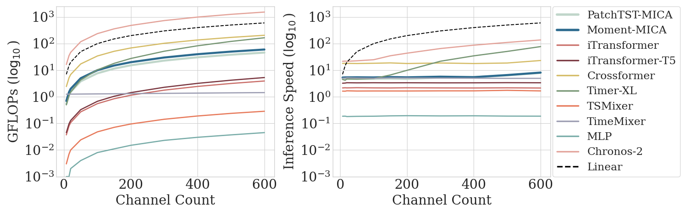
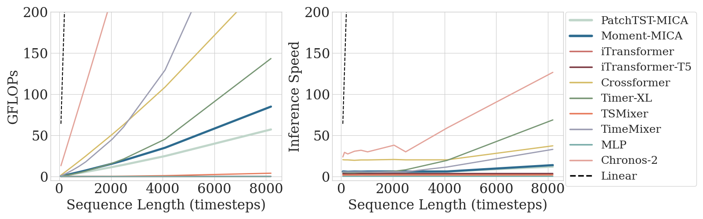
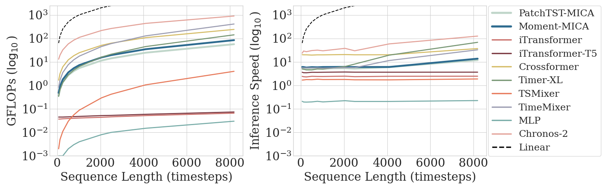

# MICA: Multivariate Infini Compressive Attention for Time Series Forecasting
____

## 📋 Rebuttal Materials

**Table 1: New Baselines: Chronos-2 (zero-shot) and TimeMixer.** Forecasting MAE averaged over 5 random seeds. MICA results correspond to the MLP-Query Gate. **Bold** = best, <u>underlined</u> = second best, <span style="color:blue">blue</span> = MICA improves over its univariate counterpart. Average rank across datasets shown at bottom (deep learning models only).
| Dataset | Freq. | MOMENT | MOMENT-MICA | PatchTST | PatchTST-MICA | iTransformer | iTransformer-T5 | Crossformer | Timer-XL | TSMixer | TimeMixer | MLP | Chronos-2 | AutoETS |
|---------|-------|--------|-------------|----------|---------------|--------------|-----------------|-------------|----------|---------|-----------|-----|-----------|---------|
| Simglucose | 5min | 5.136 | <span style="color:blue">4.347</span> | 5.593 | <span style="color:blue">4.241</span> | 4.261 | 4.446 | **4.164** | 4.662 | 6.458 | 6.670 | 8.220 | 8.835 | 9.362 |
| COVID Deaths | D | 157.292 | <span style="color:blue">104.172</span> | 141.437 | <span style="color:blue">135.718</span> | 297.885 | 165.436 | 156.161 | 174.528 | 561.950 | 96.065 | 483.689 | <u>93.739</u> | **91.579** |
| Iowa IHOP SMEX02 | 5min | 1.733 | <span style="color:blue">1.666</span> | 1.765 | <span style="color:blue"><u>1.662</u></span> | 1.953 | 1.694 | 1.746 | 1.939 | **1.661** | 1.710 | 1.821 | 1.776 | 1.781 |
| Iowa PLOWS | 5min | 1.369 | <span style="color:blue"><u>1.332</u></span> | 1.382 | <span style="color:blue">**1.327**</span> | 1.517 | 1.344 | 1.358 | 1.487 | 1.334 | 1.351 | 1.479 | 1.431 | 1.405 |
| Jena Weather | H | 9.682 | <span style="color:blue">**9.387**</span> | 9.911 | <span style="color:blue">9.543</span> | 10.794 | 10.364 | 9.503 | 10.520 | 13.941 | 13.125 | 13.483 | 9.591 | 15.030 |
| Jena Weather | D | <u>13.155</u> | 14.907 | 14.005 | <span style="color:blue">13.799</span> | 15.057 | 13.670 | 14.484 | 14.224 | 16.538 | 15.569 | 18.853 | 13.857 | **13.057** |
| M-DENSE | H | 92.637 | <span style="color:blue">**87.412**</span> | 95.861 | <span style="color:blue"><u>88.020</u></span> | 93.169 | 95.760 | 173.078 | 95.153 | 103.719 | 107.922 | 117.729 | 121.965 | 163.191 |
| M-DENSE | D | 52.927 | <span style="color:blue">51.740</span> | 53.723 | <span style="color:blue">51.959</span> | 52.650 | 49.861 | 51.195 | 51.891 | 50.529 | 58.068 | 55.281 | **43.167** | 50.577 |
| Loop-Seattle | D | 3.010 | <span style="color:blue">**2.939**</span> | 3.246 | <span style="color:blue">3.009</span> | 3.496 | 3.127 | 3.158 | 3.215 | 3.115 | 2.962 | 3.045 | <u>2.944</u> | 3.032 |
| ETT1 | H | 5.683 | 5.851 | 5.454 | <span style="color:blue"><u>5.403</u></span> | 6.010 | 5.758 | 5.682 | 5.806 | 5.506 | 6.346 | 5.747 | **5.258** | 12.092 |
| ETT1 | D | 157.189 | <span style="color:blue">157.090</span> | 155.534 | 157.871 | 163.198 | 168.808 | 208.948 | 154.405 | 185.805 | 162.778 | 185.507 | **144.588** | 165.377 |
| ETT1 | W | 982.317 | 994.716 | 1003.563 | <span style="color:blue"><u>959.206</u></span> | 998.254 | 1027.069 | 1252.076 | 1000.988 | 1076.143 | 980.674 | 1190.755 | 997.564 | **874.218** |
| ETT2 | H | 7.618 | 7.720 | 7.452 | <span style="color:blue">7.334</span> | 7.811 | 7.677 | 7.636 | 7.932 | <u>7.279</u> | 8.022 | 7.660 | **7.217** | 10.034 |
| ETT2 | D | **228.246** | 269.353 | 260.281 | <span style="color:blue">254.152</span> | 287.942 | 282.243 | 416.306 | 248.978 | 380.410 | 271.592 | 472.509 | <u>236.354</u> | 250.327 |
| ETT2 | W | 2868.244 | <span style="color:blue">2211.349</span> | 3016.452 | <span style="color:blue">2249.077</span> | 2870.885 | 2315.718 | 3337.477 | 2647.705 | 2645.104 | 2456.773 | 3048.120 | 2399.760 | **1597.126** |
| Solar | H | 12.333 | 12.914 | 12.073 | 12.847 | 12.012 | 13.492 | 25.142 | **10.872** | <u>11.078</u> | 11.986 | 13.434 | 11.365 | 27.067 |
| Solar | D | 257.150 | <span style="color:blue">240.492</span> | 258.389 | <span style="color:blue">252.718</span> | 254.190 | 277.509 | 259.512 | 250.915 | 271.532 | 299.295 | 255.307 | **231.535** | <u>237.917</u> |
| Solar | W | 991.329 | <span style="color:blue">959.544</span> | 1127.889 | <span style="color:blue">1058.990</span> | 939.926 | 855.893 | 1014.611 | 815.778 | 812.396 | 1248.227 | **788.671** | 1283.383 | 927.811 |
| **Avg. Rank** | | 5.500 | <u>4.389</u> | 6.944 | **3.722** | 8.167 | 6.500 | 7.833 | 6.556 | 6.833 | 7.667 | 9.278 | 4.611 | — |

<br>

---

<br>


**Figure**: GFLOPs and inference speed (ms) as a function of channel count ($C=[7, 600]$).


**Figure**: GFLOPs (log_10) and inference speed (ms) (log_10) as a function of channel count ($C=[7, 600]$).


**Figure**: GFLOPs and inference speed (ms) as a function of sequence length ($C=[64, 8192]$).


**Figure**: GFLOPs (log_10) and inference speed (ms) (log_10) as a function of sequence length ($C=[64, 8192]$).

<br>

---

<br>

**Table 2: Weighted channels ablation study.** Comparison of uniform (U), static (S), and dynamic (D) channel weighting variants against the PatchTST vanilla baseline. Values are MAE averaged over 5 random seeds with standard deviation in parentheses. **Bold** = best, <u>Underlined</u> = second-best.

| **Dataset** | **Freq.** | **Vanilla** | **MICA (U)** | **MICA (S)** | **MICA (D)** |
|---|---|---|---|---|---|
| COVID Deaths | D | 141.437 (43.419) | <u>135.718</u> (40.678) | **130.176** (27.018) | 143.915 (86.827) |
| Jena Weather | H | 9.911 (0.225) | 9.543 (0.298) | <u>9.517</u> (0.176) | **9.476** (0.223) |
| | D | 14.005 (0.185) | **13.799** (0.328) | 13.944 (0.260) | <u>13.889</u> (0.382) |
| M-DENSE | D | 53.723 (0.236) | <u>51.959</u> (0.203) | 52.078 (0.302) | **51.594** (1.182) |
| ETT1 | D | **155.534** (2.508) | <u>157.871</u> (2.663) | 159.448 (2.065) | 158.186 (1.721) |
| | W | 1003.563 (29.109) | <u>959.206</u> (42.454) | **938.360** (22.515) | 965.903 (27.555) |
| ETT2 | D | 260.281 (11.639) | <u>254.152</u> (5.445) | **253.327** (5.868) | 255.058 (9.701) |
| | W | 3016.452 (686.651) | **2249.077** (188.625) | 2436.890 (214.840) | <u>2324.161</u> (157.982) |
| Solar | D | 258.389 (1.663) | **252.718** (1.232) | 254.602 (1.290) | <u>252.852</u> (2.516) |
| | W | 1127.889 (20.369) | **1058.990** (38.140) | 1067.190 (25.051) | <u>1060.330</u> (46.974) |
| **Average Rank** | | 3.6 | **1.7** | 2.4 | 2.3 |

<br>

---

<br>

**Table 3: Longer context ablation study.** Values are MAE averaged over 5 random seeds with standard deviation in parentheses. Blue results indicate lower forecast error of MICA compared with the univariate model counterpart. 
| **Dataset** | **Freq.** | **MOMENT Baseline** | **MOMENT-MICA** | **PatchTST Baseline** | **PatchTST-MICA** |
|---|---|---|---|---|---|
| M-DENSE | D | 48.705 (0.772) | 50.247 (0.765) | 55.009 (0.475) | <span style="color:blue">52.655 (1.624)</span> |
| Jena Weather | H | 10.205 (0.121) | <span style="color:blue">9.536 (0.086)</span> | 10.432 (0.183) | <span style="color:blue">9.930 (0.208)</span> |
| | D | 11.438 (0.249) | 12.890 (0.905) | 12.363 (0.293) | 12.504 (0.133) |
| ETT1 | D | 163.611 (2.754) | <span style="color:blue">158.836 (4.332)</span> | 157.270 (1.417) | 159.723 (1.769) |
| | W | 979.311 (14.820) | 999.862 (22.948) | 935.219 (38.262) | 947.473 (19.065) |
| **Average Rank** | | 2.5 | 2.3 | 2.7 | 2.5 |


____


We propose MICA (Multivariate Infini Compressive Attention), a memory-efficient attention-based forecasting architecture for multivariate time series. MICA adapts compressive memory techniques with linear attention, originally developed for long-context language models, from context com- pression to channel compression, enabling a computationally efficient cross-channel architecture component that scales linearly in both time and memory with sequence length and channel count.

We implement our method and various baselines within the open-source neuralforecast repository [1], leveraging its available models and standardized training infrastructure for consistent benchmarking.

1. Olivares, K. G., Challú, C., Garza, F., Canseco, M. M., and Dubrawski, A. NeuralForecast: User friendly state-of-the-art neural forecasting models. PyCon Salt Lake City, Utah, US 2022, 2022.

<h4><u>Sections:</u></h4>

1. [Environment Setup](#Environment-Setup)
2. [Download Datasets](#Download-Datasets)
3. [Train Experiment Models and Get Forecasts](#Run-Experiments)
4. [Evaluate Forecasts](#Eval-Fcsts)
5. [Experiment Catalog](#Experiment-Catalog)
6. [Reference](#Reference)


## Environment Setup

### 1. Create and Activate Conda Environment
```bash
conda create -n neuralforecast python=3.11.0
conda activate neuralforecast 

git clone <repo>
cd ./neuralforecast
git checkout remotes/origin/mica
pip install -e .
cd ./mica
pip install -r mica_requirements.txt
```


## Download Datasets

### 1. Download GiftEval Datasets

Download the required datasets from the GiftEval benchmark (requires that `git lfs` is installed):
```bash
# Clone the GiftEval dataset from huggingface 
git clone https://huggingface.co/datasets/Salesforce/GiftEval
```


### 2. Download and Preprocess Iowa Windspeed Datasets

For each linked below. Follow the directions to submit data orders:

PLOWS: Iowa Automated Weather Observing System (AWOS) 1-minute Data ([link](https://data.eol.ucar.edu/dataset/113.038))

SMEX02: Automated Weather Observing System (AWOS) Iowa 1-min Data ([link](https://data.eol.ucar.edu/dataset/80.003))

IHOP_2002: Automated Weather Observing System (AWOS) Iowa 1-min Data ([link](https://data.eol.ucar.edu/dataset/77.099))

Change the folder names to `iowa_PLOWS_data`, `iowa_SMEX02_data`, and `iowa_IHOP_data`, respectively. Move these dataset folders to the ./mica folder.


```bash
cd ~/neuralforecast/mica/preprocessing
python preprocess_iowa_IHOP_SMEX02_datasets.py
python preprocess_iowa_PLOWS_dataset.py
```


### 3. Preprocess Simglucose Dataset

```bash
git clone git@github.com:{anon}/simglucose.git
cd ~/simglucose
git checkout remotes/origin/harrison_benedict_eqn
pip install -e .

cd ~/neuralforecast/mica/preprocessing
python preprocess_simglucose_dataset.py
```

## Train Experiment Models and Get Forecasts

### 1. Configure Experiment Settings

Open `launch_exp.py` in the `./mica/training` folder and modify the following parameters:

#### Set Output Directory
```python
SAVE_DIR = "/path/to/your/output/directory"  # Change this to your desired output location
```

#### Set file name
```python
FILE_NAME = "train_models" FILE_NAME = "train_models"  # train_models used for all experiments except 'vanilla_pca_t5tiny' and 'vanilla_ica_t5tiny' which use "train_models_pca" or 'chronos2.0_baselin' which uses "zeroshot_models"
```

#### Set Experiment Name
```python
EXPERIMENT_NAME = "my_experiment_name"  # See experiment names in experiment catalog below
```

#### Set GiftEval dataset location
```python
GIFT_EVAL_DIR = '/path/to/your/downloaded/GiftEval' # This is the folder that contains all GiftEval datasets (see step 1 in Download Datasets section)
```

#### Select Datasets
Comment out datasets you **don't** want to run. Leave uncommented only the datasets you want to experiment with:
```python
# Example: To run only ETTh1 and Weather datasets, comment out the others
datasets = [
    'ETTh1',           # Keep uncommented
    # 'ETTh2',         # Commented out - won't run
    # 'ETTm1',         # Commented out - won't run
    'Weather',         # Keep uncommented
    # 'Electricity',   # Commented out - won't run
]
```

#### Set GPU indices
```python
GPU_INDICES = [0, 1, 2, 3]  # Update this based on your available GPU resources
```

### 2. Launch Experiments
```bash
python3 launch_experiments.py # This file automatically  creates tmux sessions, distributes, and launches the experiments among gpus based on the dataset and random_seed combinations.
```

After running experiments, results will be saved in your `SAVE_DIR`:
```
SAVE_DIR/
├── {EXPERIMENT_NAME}/
│   ├── {DATASET_NAME}/
│   │   ├── rs1_ishm2_h{HORIZON}/
│   │   │   ├── {model_name}.ckpt
│   │   │   └── forecast.csv
│   │   ├── rs2_ishm2_h{HORIZON}/
│   │   ├── rs3_ishm2_h{HORIZON}/
│   │   ├── rs4_ishm2_h{HORIZON}/
│   │   └── rs5_ishm2_h{HORIZON}/
│   └── ...
```

**Example:**
```
SAVE_DIR/
├── vanilla_t5tiny/
│   ├── ett1_D/
│   │   ├── rs1_ishm2_h96/
│   │   │   ├── AutoMOMENT_vanilla_0.ckpt
│   │   │   ├── AutoMOMENT_vanilla_headmixer_0.ckpt
│   │   │   ├── AutoPatchTSTMultivariate_vanilla_0.ckpt
│   │   │   ├── AutoPatchTSTMultivariate_vanilla_headmixer_0.ckpt
│   │   │   └── forecast.csv
│   │   ├── rs2_ishm2_h96/
│   │   └── ...
│   └── Weather/
│       └── ...
```

**Note:** `rs{1-5}` indicates 5 random seed runs per dataset/horizon combination. Each run contains checkpoints for all model variants tested.


## Evaluate Forecasts
Specify the experiment name and the GiftEval repo path within the command to evaluate forecast results:

```
cd ~/neuralforecast/mica/training/
python -m forecast_error --experiment_name t5tiny_vanilla --GIFT_EVAL_path /home/GiftEval
```


## Experiment Catalog

| Category | Experiment Name | Gating Mechanism | Channel Exclusion | Head Type |
|----------|----------------|------------------|-------------------|-----------|
| **Infini Variants** | `infini_mlpmixer_t5tiny` | MLP-based | ✓ / ✗ | - |
| | `infini_mlpquerymixer_t5tiny` | MLP + Query | ✓ / ✗ | - |
| | `infini_layerwise_t5tiny` | Layer-specific β | ✓ / ✗ | - |
| | `infini_layerwise_channelwise_t5tiny` | Layer + Channel β | ✓ / ✗ | - |
| | `infini_channelwise_t5tiny` | Channel-specific β | ✓ / ✗ | - |
| | `infini_t5tiny` | Shared β | ✓ / ✗ | - |
| **Baselines** | `vanilla_t5tiny` | Standard attention | - | Uni / Multi |
| | `vanilla_pca_t5tiny` | Standard + PCA | - | Univariate |
| | `multivariateMLP_baseline` | - | - | - |
| | `tsmixer_baseline` | - | - | - |
| | `itransformer_baseline` | - | - | - |
| | `timerxl_baseline` | - | - | - |
| | `crossformer_baseline` | - | - | - |
| | `AutoETS` | Statistical | - | - |

**Note:** ✓ = with channel exclusion, ✗ = without channel exclusion
